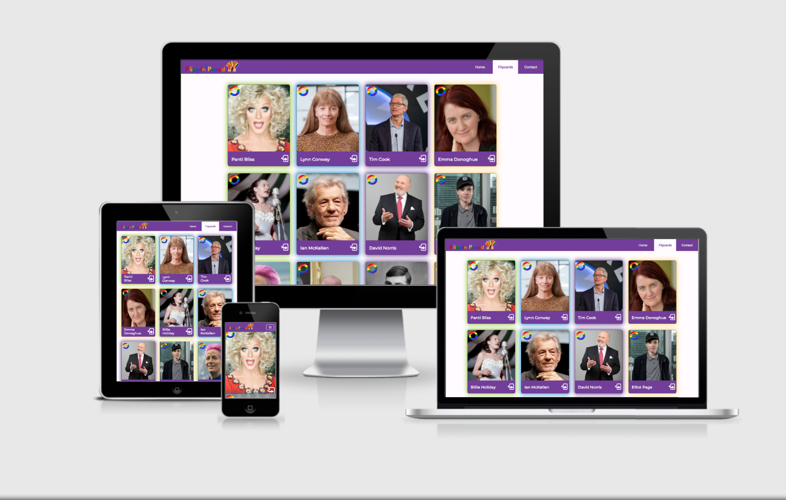

<p align="center"></p>

<p align="center"></p>

<h1 align='center'>Flippin' Proud</h1>

<p align="center"></p>

## What's It All About?
Flippin' Proud is a team collaboration project to create an application to celebrate Pride month. The aim is to help educate and bring people together by showcasing important members of the LGBTQ+ community.

Flippin' Proud is an interactive application to promote the important work of a number of LGBTQ+ icons from across the globe. Their work and bravery has helped combat ignorance and intolerance and helped to lay the foundations for others to come forward and work towards a brighter future. 

Users can view images of the icons and click on the image to flip over for some background information on the importance of the individual to the LGBTQ+ community.

The project has been made possible by the hard work and collaboration of the following team of developers:

 - [John Doyle](https://github.com/Aramantos)
 - [Christine Greaney-Kelley](https://github.com/christine-gk416)
 - [Paul Harrington](https://github.com/loosenthedark)
 - [Steven Kenny](https://github.com/SteveKennyUK)
 - [Adrian Looney](https://github.com/Jammerref2015)

### [View the live project here.](https://jammerref2015.github.io/Flipping-Proud/)

## User Experience (UX)
This website will follow the principles of User Centred Design (UCD), which will focus on placing users at the centre of the design and development process.
### User Stories
#### User Goals (general visitor to the site)
 -   As a user, I want to be immediately drawn into the site and understand its main purpose.
 -   As a user, I want to be able to easily identify what I need and navigate the site to get to it.
 -   As a user, I want concise but informative content, displayed in an aesthetic manner.
 -   As a user, I want to be able to view the site clearly and intuitively on different device sizes.
 -   As a user, I expect the site to be fully accessible.
#### Developer Goals 
 -  As a developer, I want to build on teamworking skills and enhance my communication skills.
 - As a developer, I want to practise and improve my current knowledge and skills.
 - As a developer, I want to learn new skills and increase my knowledge of various languages.
 -  As a developer, I want to learn how to use version control within a team environment.
 -  As a developer, I would like to produce a fully responsive application to add to my portfolio of work and showcase to potential employers. 

### Project Design
-   #### Colour Scheme
	It was important to use a bright colour scheme, broadly following the lines of the rainbow flag which is so synonymous with Pride and the LGBTQ+ community. This immediately makes the user feel comfortable and reinforces the subject matter of the site.
	
	The following colour scheme was decided upon with assistance from the [coolors](https://coolors.co/ffca3a-8ac926-1982c4-6a4c93-343330-fffbfe) website:
	
	 
-   #### Typography
	Montserrat was chosen as the main font to be used for the site. It is a clean font, which is easy to read for accessibility purposes and also a popular font, used on many existing websites with a LGBTQ+ theme. Roboto acts as a second font as this pairs well with Montserrat.
	Sans serif will act as a fallback font in case the chosen fonts are not imported correctly.
-   #### Wireframes 
	Wireframes for the project can be found [here](https://github.com/Jammerref2015/Flipping-Proud/blob/master/static/images/flippin-proud-wireframes.pdf)

## Features
### Existing Features
- The site consists of three pages, each with a responsive navigation bar at the top.
- A jumbotron greets users on the landing page, with some introductory information on the nature of the site and a call to action button to take the user to the main flipcard page.
- The main flipcard page is an interactive invitation to the user to learn about the important work that various people have undertaken to improve the LGBTQ+ community.
- A final contact page, setting out information about the site developers.   

## Technologies Used

### Languages Used

-   [HTML5](https://en.wikipedia.org/wiki/HTML5) for structuring the site
-   [CSS3](https://en.wikipedia.org/wiki/Cascading_Style_Sheets) for styling the site
- [JavaScript](https://en.wikipedia.org/wiki/JavaScript) for site logic
    


### Frameworks, Libraries & Programs Used

1. [Bootstrap 4.6:](https://getbootstrap.com/docs/4.6/getting-started/introduction/)
    - Bootstrap was used to assist with the responsiveness and styling of the website.
1. [Hover.css:](https://ianlunn.github.io/Hover/)
    - Hover.css was used to add hover effects to buttons and icons.
1. [Google Fonts:](https://fonts.google.com/)
    - Google Fonts was used to import the 'Roboto' and 'Montserrat' fonts into the style.css file which is used throughout the project.
1. [Font Awesome:](https://fontawesome.com/)
    - Font Awesome was used to add icons.
1. [jQuery:](https://jquery.com/)
    - jQuery was used to assist with manipulation of the Document Object Model.
1. [JSON:](https://en.wikipedia.org/wiki/JSON)
	- JSON was used to store and transport data.
1. [Git](https://git-scm.com/)
    - Git was used for version control by utilising the Gitpod terminal to commit to Git and Push to GitHub.
1. [GitHub:](https://github.com/)
    - GitHub was used to store the project code after being pushed from Git.
1. [Balsamiq:](https://balsamiq.com/)
    - Balsamiq was used to create the [wireframes]() during the design process.
1. [Photoshop:](https://www.adobe.com/uk/products/photoshop.html)    
    - Photoshop was used to create the website logo.
1. [favicon.io:](https://favicon.io/favicon-converter/)    
    - favicon.io was used to create a favicon with full web browser compatibility.   
1. [WebAIM](https://webaim.org/resources/contrastchecker/)          
    - WebAIM was used to check that foreground and background colour contrasts meet WCAG accessibility requirements.
1. [Webformatter](https://webformatter.com)   
    - Webformatter was used to assist in optimising code readability. 
1. [Autoprefixer](https://autoprefixer.github.io/)   
    - Autoprefixer was used to parse CSS and add vendor prefixes.
1. [TinyPNG](https://tinypng.com/)   
    - Tiny PNG was used for image compression.
 1. [PicResize](https://picresize.com/)
    - PicResize was used to crop and resize images.

## Testing
### Validation
- HTML passed through the [validator](https://validator.w3.org/) without any errors. 
- CSS passed through the [validator](https://jigsaw.w3.org/css-validator/) without errors.
- JavaScript passed through the [validator](https://jshint.com/) without any errors.
### Responsiveness
- Google Dev Tools and various device sizes were used extensively to test device responsiveness.
### Bugs
- We encountered a particular bug relating to iOS devices when viewing the flipcards.html page. Rather than revealing the text, the cards flip to reveal a mirror image of the image on the front of the card. Given more time, a full investigation of this issue would be undertaken but it is suspected that it is an iOS issue, where there is no support for this functionality. 

## Deployment
### GitHub Pages

This project has been deployed to GitHub Pages. The deployment process is as follows -

1. Log in to GitHub and locate the [relevant repository](https://github.com/Jammerref2015/Flipping-Proud). If you do not have a GitHub account, you may create one [here](https://github.com/join).
2. At the top of the repository, select 'Settings'. 
3. On the 'Settings' page, scroll down the menu on the left-hand side and select 'Pages', near the bottom of the menu. 
This will open GitHub pages.
4. Under 'Source', click the dropdown titled 'None' and select the 'master' branch. Click on 'Save'. 
5. The page will automatically refresh and inform you that the site is ready to be published and provide the https:// address. 
6. A [link](https://jammerref2015.github.io/Flipping-Proud/) to the now published site can be found in the GitHub 'Pages' section of 'Settings'.

### Forking the GitHub Repository

It is possible to fork this GitHub repository and make a copy of the original repository to view and/or make changes without affecting the original. This is achieved by following these steps -

1. Log in to your GitHub account and locate the [relevant repository](https://github.com/Jammerref2015/Flipping-Proud).
2. Click on 'Fork', located at the top right-hand side of the repository page.
3. You will now have a copy of the repository in your own GitHub account.

### Making a Local Clone
It is possible to copy the repository to your local machine so that you can fix merge conflicts, add or remove files and push larger commits without affecting the original repository. 

Cloning a repository pulls down a full copy of all the repository data that GitHub has at that point in time. See [GitHub Docs](https://docs.github.com/en/github/creating-cloning-and-archiving-repositories/cloning-a-repository) for further information and below for a summary -
1.  Log in to your GitHub account and locate the [relevant repository](https://github.com/Jammerref2015/Flipping-Proud).
2. Click on the 'Code' button, next to the green 'Gitpod' button. This will reveal the 'Clone' option.
3. In order to clone the repository using HTTPS, select HTTPS and copy the link. There is a copy button to the right of the URL.
4. Next, open Git Bash. See [here](https://git-scm.com/downloads) for download options, if required.
5. Change the current working directory on your local machine to the location where you want the cloned directory to be made.
6. Type `git clone` into your IDE terminal followed by the URL you copied in Step 3.

```
https://github.com/Jammerref2015/Flipping-Proud.git
```

7. Press Enter. 
8. Your local clone will be created.

See [GitHub Docs](https://docs.github.com/en/github/creating-cloning-and-archiving-repositories) for more information on the above processes.

## Credits
### Code
-   [Bootstrap 4.6](https://getbootstrap.com/docs/4.6/getting-started/introduction/): Bootstrap Library was used throughout the project, mainly to make the site responsive using the Bootstrap Grid System.
-   Base code for the sparkle effects was provided by [Simon Goellner](https://codepen.io/simeydotme/pen/jgcvi/) and modified by the developers.
### Content
Card content courtesy of [Wikipedia](https://en.wikipedia.org/wiki/Main_Page) and [bi.org](https://bi.org/en)
### Media
The images used to create the cards originate from the following sources - 

 - Panti Bliss courtesy of [Conor Horgan](http://www.conorhorgan.com/) via [Wikipedia](https://en.wikipedia.org/wiki/Panti)
 - Lynn Conway courtesy of [The New York Times](https://www.nytimes.com/2020/11/21/business/lynn-conway-ibm-transgender.html)
 - Tim Cook courtesy of [Austin Community College](https://www.flickr.com/photos/accdistrict/35992738453/) via [Wikipedia](https://en.wikipedia.org/wiki/Tim_Cook#/media/File:Tim_Cook_%282017,_cropped%29.jpg)
 - Emma Donoghue courtesy of [The Irish Times](https://www.irishtimes.com/culture/books/emma-donoghue-it-feels-very-odd-to-be-benefiting-from-the-crisis-1.4299127)
 - Billie Holiday courtesy of [Bill Spilka](https://www.popartphotoshow.com/artists/bill-spilka/)/[Getty Images](https://www.gettyimages.co.uk/detail/news-photo/jazz-and-blues-singer-billie-holiday-performs-at-the-news-photo/167855118?adppopup=true) 
 - Sir Ian McKellen courtesy of [Gage Skidmore](https://www.flickr.com/people/gageskidmore/) via [Wikipedia](https://en.wikipedia.org/wiki/Ian_McKellen#/media/File:SDCC13_-_Ian_McKellen.jpg)
 - David Norris courtesy of [Wikipedia (source unknown)](https://en.wikipedia.org/wiki/David_Norris_%28politician%29)
 - Elliot Page courtesy of [Rich Polk](http://richpolk.com/ll2zy7a1hcrj17f16wrab8udsjyy5g)/[Getty Images](https://www.gettyimages.co.uk/detail/news-photo/ellen-page-attends-the-imdb-studio-presented-by-intuit-news-photo/1172973866?adppopup=true) for [IMDb](https://www.imdb.com/)
 - Megan Rapinoe courtesy of [Lorie Shaull](https://www.flickr.com/people/11020019@N04) via [Wikipedia](https://en.wikipedia.org/wiki/Megan_Rapinoe#/media/File:Megan_Rapinoe_%2848675274817%29_%28cropped%29.jpg)
 - Gareth Thomas courtesy of [UK Home Office](https://www.flickr.com/people/49956354@N04) via [Wikipedia](https://en.wikipedia.org/wiki/Gareth_Thomas_%28rugby%29#/media/File:Gareth_Thomas_%28rugby_player%29.jpg)
 - Alan Turing courtesy of [The Turing Digital Archive](http://www.turingarchive.org/viewer/?id=521&title=4) via [Wikipedia](https://en.wikipedia.org/wiki/Alan_Turing#/media/File:Alan_Turing_Aged_16.jpg)
 - Oscar Wilde courtesy of [Napoleon Sarony](https://en.wikipedia.org/wiki/Napoleon_Sarony) via [Wikipedia](https://en.wikipedia.org/wiki/Oscar_Wilde#/media/File:Oscar_Wilde_3g07095u-adjust.jpg)

### Acknowledgements
The team would like to thank our mentor [Aukje van der Wal](https://github.com/byIlsa) for her amazing support, guidance and humour throughout the entire project.
### Notice
This site has been created for educational purposes only.
